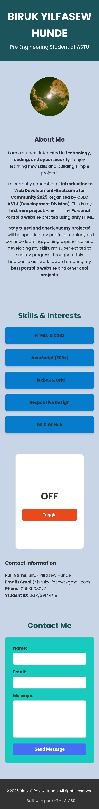
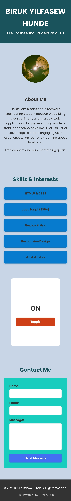

# Toggle Text (ON / OFF) – Mini Project

## 📌 Project Overview

This mini project demonstrates how **HTML, CSS, and JavaScript** work together to create an interactive web page.  
The main feature of the project is a **Toggle Button** that switches a heading text between **ON** and **OFF** when clicked.

The project is designed to help beginners understand:
- Basic HTML structure
- Core CSS styling
- JavaScript DOM manipulation
- Handling user interactions using click events

⚠️ No CSS or JavaScript frameworks were used in this project.

---

## 🎯 Project Objectives

- Practice writing structured HTML
- Apply CSS styling and layout techniques
- Learn how JavaScript interacts with HTML elements
- Implement a simple toggle logic using JavaScript

---

## 🛠️ Technologies Used

- **HTML5** – Structure of the webpage  
- **CSS3** – Styling, layout, responsiveness  
- **JavaScript (Vanilla JS)** – Toggle functionality  

---

## ✨ Features

- Displays a heading with initial text **OFF**
- Toggle button switches text between **ON** and **OFF**
- Centered layout using **Flexbox**
- Responsive design for different screen sizes
- Clean and readable UI

---

## 📁 Project Structure

```
📦 Personal Profile
├── index.html
├── styles.css
├── java.js
├── README.md
└── screenshots/
    ├── off.png
    └── on.png
```

---

## 🧠 How It Works

1. The page loads with the heading showing **OFF**
2. When the user clicks the **Toggle** button:
   - The text changes to **ON**
3. Clicking the button again:
   - Changes the text back to **OFF**
4. This behavior is controlled using JavaScript with a state variable

---

## 📱 Responsive Design

- Content remains centered on small screens
- Text stays readable on all devices
- Button resizes properly
- No horizontal scrolling

---

## 📌 Expected Behavior

- Page loads → **OFF**
- Click Toggle → **ON**
- Click Toggle again → **OFF**

---

## 👤 Author

**Biruk Yilfasew Hunde**  
Pre-Engineering Student at ASTU  

---

## 📜 License

This project is created for educational purposes and personal practice.

## 📸 Screenshots

### Toggle OFF State


### Toggle ON State

